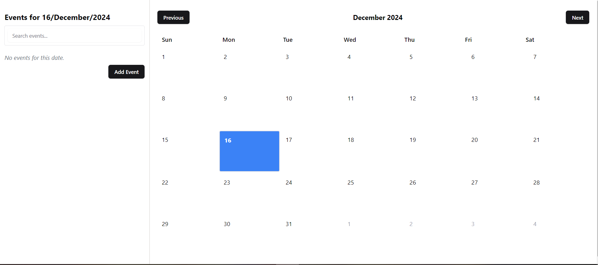
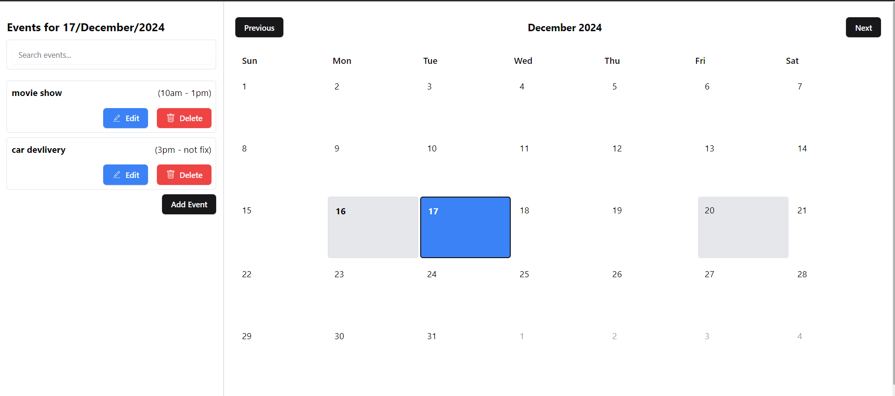
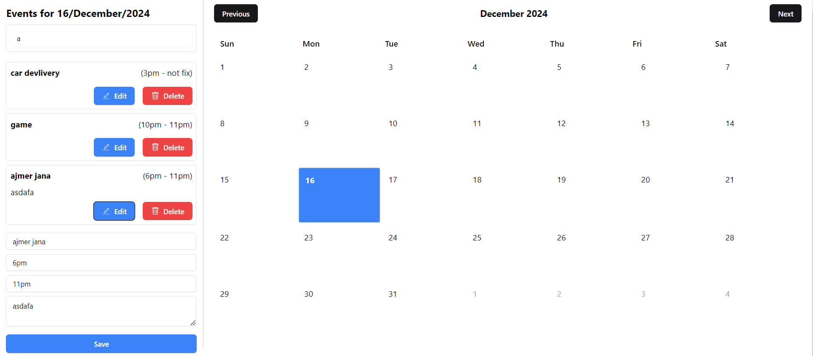

# Event Management Application

This is a simple Event Management application built using Next.js, Tailwind CSS, Shadcn UI, date-fns, and react-icons. It allows users to add, edit, delete, and view events for specific dates. The calendar interface allows users to select a date and see the events scheduled for that day. The app also provides a search feature to filter events by title or description.

## Features
- View a calendar with events.
- Add, edit, and delete events for selected dates.
- Search events by title or description.
- Responsive design with Tailwind CSS and Shadcn UI.
## Screenshots

1. **Calendar View**  
   Displays the calendar with the current month and allows users to select a specific date.

   

2. **Event List**  
   Shows the list of events for the selected date, with options to edit or delete events.

   

3. **Add New Event**  
   Added "Search events by title or description" .

   

4. **Event Search**  
   Allows searching events by title or description.

   


## Live Demo

You can view a live version of the Event Management Application by clicking the link below:

[Live Demo](https://your-deployed-app-link.com)


## Installation

### 1. Clone the repository
First, clone the repository to your local machine.

```bash
https://github.com/peyush-nuwal/event-mangement-calender.git
```


### 2. Install dependencies
Navigate to the project directory and install the required dependencies.

```bash
cd event-manager
npm install
```

### 3. Set up your local environment
Make sure you have Node.js installed on your local machine. You can check if Node.js is installed by running:

```bash
node -v

```


###4. Run the application locally
To start the development server, run the following command:

```bash
npm run dev


```


### 5. Build and deploy
To build the application for production, run the following command:

```bash

npm run build
```
